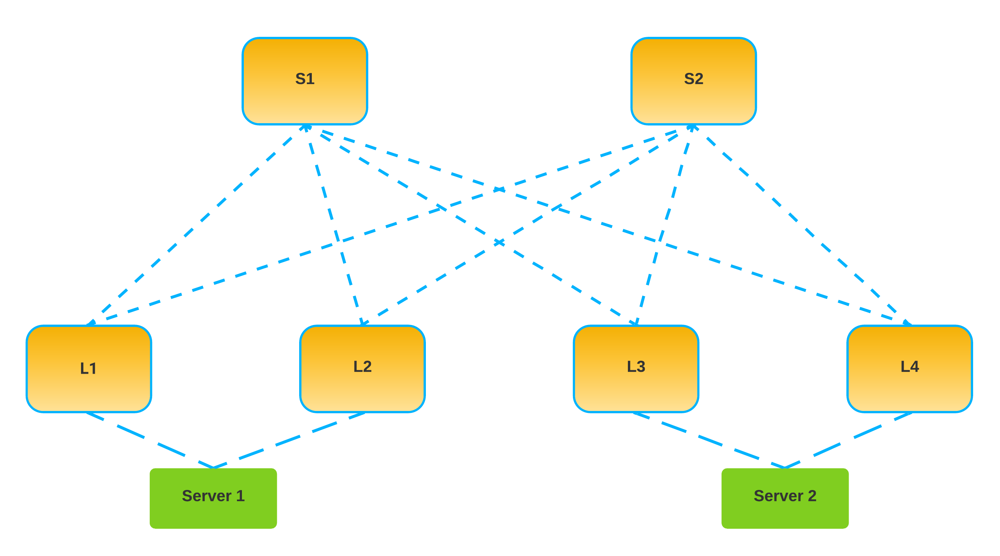

# cumulus-vxlan-evpn

In this lab, we will create a Spine-Leaf topology based on Nvidia/Cumulus VX. We will use a VXLAN Overlay with EVPN as the control plane.

The idea of the lab is to learn about VXLAN/EVPN while automating the deployment of the fabric as much as possible.

## Topology

The basic topology is shown below.


## Requirements

```
1 - Install vagrant
2 - Install virtualbox
```

- **For macOS users**:
  - Open your terminal
  - Install Hombrew `/bin/bash -c "$(curl -fsSL https://raw.githubusercontent.com/Homebrew/install/master/install.sh)"`
  - Install `Virtualbox` with homembrew-cask `brew cask install virtualbox`
  - Install `Vagrant` with homembrew-cask `brew cask install vagrant`
- **For Windows users**:
  - You must ensure that `Hyper-V` is not enabled on Windows. [Disabling Hyper-V on Windows 10](https://docs.microsoft.com/en-us/troubleshoot/windows-client/application-management/virtualization-apps-not-work-with-hyper-v#resolution)
  - Download and install [Virtualbox](https://www.virtualbox.org/wiki/Downloads)
  - Download and install [Vagrant](https://www.vagrantup.com/downloads)
- **For Linux users**:
  - Download and install [Virtualbox](https://www.virtualbox.org/wiki/Linux_Downloads)
  - Download and install [Vagrant](https://www.vagrantup.com/downloads)

## How do I start?

- Run this command inside the current folder: `vagrant up`
